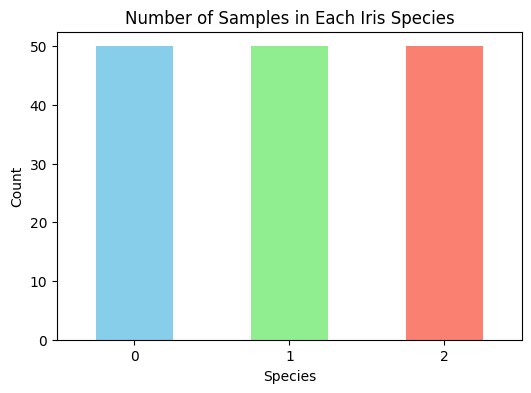
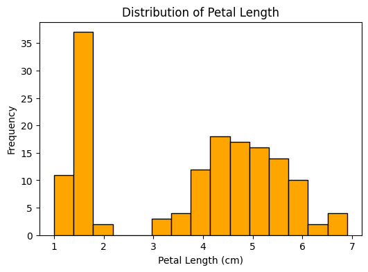
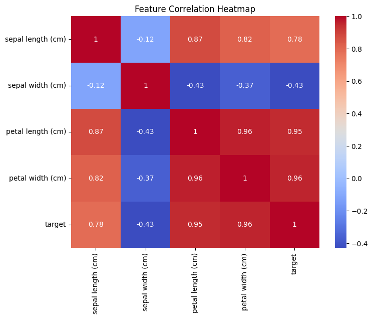
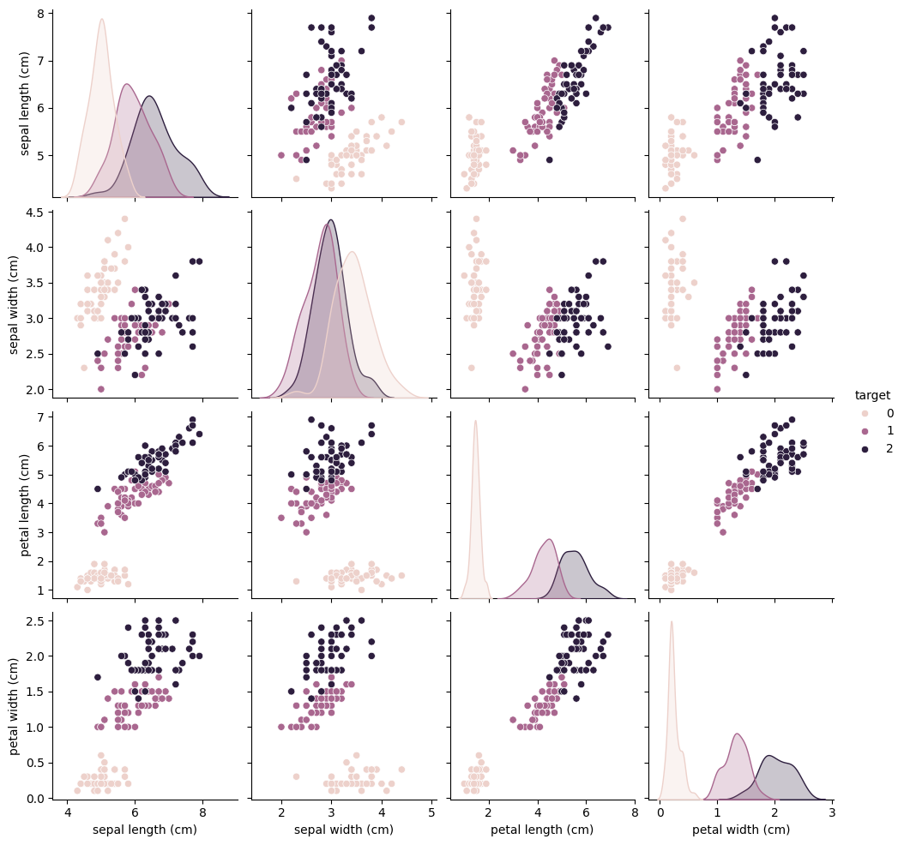

# 🌸 Iris Dataset Visualization

## 📌 Problem Statement

Exploratory Data Analysis (EDA) is an essential step in understanding a dataset before applying machine learning techniques. This project focuses on visualizing the Iris dataset to identify feature distributions, relationships between variables, and differences among flower species using various visualization techniques.

---

## 📊 Dataset Details

* **Dataset:** Iris Dataset
* **Source:** Scikit-learn Built-in Dataset
* **Total Samples:** 150
* **Features:**

  * Sepal Length (cm)
  * Sepal Width (cm)
  * Petal Length (cm)
  * Petal Width (cm)
* **Target Classes:**

  * Setosa
  * Versicolor
  * Virginica

---

## 🛠️ Approach

The following steps were performed:

1. Loaded the Iris dataset using Scikit-learn.
2. Converted the dataset into a Pandas DataFrame.
3. Explored the dataset using descriptive statistics.
4. Created multiple visualizations:

   * Bar Chart (Species Count)
   * Histogram (Feature Distribution)
   * Scatter Plot (Feature Relationships)
   * Pair Plot (Comparison of Multiple Features)
   * Correlation Heatmap
5. Interpreted the relationships and distributions of different features.

---

## 📈 Results

The visualizations revealed several important insights:

* All three Iris species are equally represented in the dataset.
* Petal length and petal width show a strong positive correlation.
* Setosa is clearly distinguishable from the other two species based on petal measurements.
* Versicolor and Virginica exhibit some overlap but remain separable using multiple feature combinations.
* Feature distributions provide a clear understanding of variation among species.

These visualizations demonstrate how Exploratory Data Analysis helps uncover meaningful patterns before model development.

---

## 🛠️ Technologies Used

* Python
* Pandas
* Matplotlib
* Seaborn
* Scikit-learn

---

## 📌 Outcome

This project successfully demonstrates the use of visualization techniques to understand the Iris dataset and lays the foundation for future machine learning tasks.

## Screenshots

